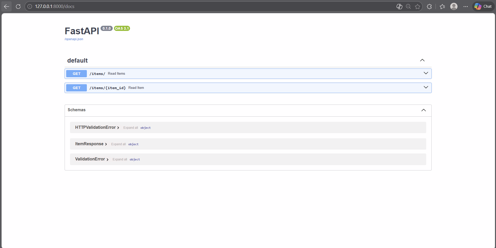

# 📦 FastAPI CRUD Dasar – GET Items API

## 📖 Deskripsi Project

Project ini merupakan implementasi **CRUD dasar menggunakan FastAPI dan SQLAlchemy** dengan database **SQLite**.

Pada tugas ini hanya diimplementasikan endpoint:

* `GET /items/` → Menampilkan seluruh data item
* `GET /items/{id}` → Menampilkan item berdasarkan ID

API menggunakan **Pydantic** untuk validasi dan serialisasi output.

Project ini dibuat untuk memenuhi tugas **Hands-on: CRUD Dasar** pada mata kuliah **Pemrograman Web Lanjutan**.

---

# 🧑‍💻 Informasi Project

| Informasi       | Keterangan                                                       |
| --------------- | ---------------------------------------------------------------- |
| Nama Project    | FastAPI CRUD Basic                                               |
| Bahasa          | Python                                                           |
| Framework       | FastAPI                                                          |
| Database        | SQLite                                                           |
| ORM             | SQLAlchemy                                                       |
| Validasi Data   | Pydantic                                                         |
| Dokumentasi API | Swagger UI                                                       |
| Repository      | https://github.com/Davidzen111/pemweb-lanjut-tugas2-fastapi-crud |

---

# 🛠️ Teknologi yang Digunakan

| Teknologi  | Fungsi                                         |
| ---------- | ---------------------------------------------- |
| FastAPI    | Framework untuk membuat REST API               |
| SQLAlchemy | ORM untuk menghubungkan Python dengan database |
| SQLite     | Database ringan berbasis file                  |
| Pydantic   | Validasi dan serialisasi data                  |
| Uvicorn    | ASGI server untuk menjalankan FastAPI          |

---

# 📂 Struktur Project

```
pemweb-lanjut-tugas2-fastapi-crud
│
├── __pycache__/
├── README.md
├── crud.py
├── database.py
├── items.db
├── main.py
├── models.py
├── requirements.txt
├── schemas.py
└── swagger.png #hanya untuk dokumentasi screenshoot
```

---

# ⚙️ Persiapan Sebelum Menjalankan Project

Pastikan sudah menginstall:

| Software | Minimal Version |
| -------- | --------------- |
| Python   | 3.8+            |
| pip      | Latest          |

Cek dengan perintah:

```bash
python --version
pip --version
```

---

# 🚀 Langkah-Langkah Menjalankan Project

## 1️⃣ Clone Repository

```bash
git clone https://github.com/Davidzen111/pemweb-lanjut-tugas2-fastapi-crud.git
```

Masuk ke folder project:

```bash
cd pemweb-lanjut-tugas2-fastapi-crud
```

---

## 2️⃣ Membuat Virtual Environment (Opsional)

```bash
python -m venv venv
```

Aktifkan environment:

**Windows**

```bash
venv\Scripts\activate
```

**Mac / Linux**

```bash
source venv/bin/activate
```

---

## 3️⃣ Install Dependency

```bash
pip install fastapi uvicorn sqlalchemy pydantic
```

---

## 4️⃣ Menjalankan Server FastAPI

Jalankan perintah:

```bash
uvicorn main:app --reload
```

Server akan berjalan di:

```
http://127.0.0.1:8000
```

---

# 📑 Dokumentasi API (Swagger UI)

FastAPI secara otomatis menyediakan dokumentasi interaktif melalui Swagger UI.

Buka di browser:

```
http://127.0.0.1:8000/docs
```

Melalui halaman ini kita dapat:

* melihat seluruh endpoint
* mencoba request langsung
* melihat response API

---

# 🔗 Endpoint API

| Method | Endpoint    | Deskripsi                       |
| ------ | ----------- | ------------------------------- |
| GET    | /items/     | Menampilkan semua item          |
| GET    | /items/{id} | Menampilkan item berdasarkan ID |

---

# 📌 Contoh Response API

## GET /items/

Response:

```json
[
  {
    "id": 1,
    "name": "Laptop",
    "description": "Laptop Gaming"
  },
  {
    "id": 2,
    "name": "Mouse",
    "description": "Wireless Mouse"
  }
]
```

---

## GET /items/{id}

Contoh request:

```
GET /items/1
```

Response:

```json
{
  "id": 1,
  "name": "Laptop",
  "description": "Laptop Gaming"
}
```

---

# 🗄️ Database

Project ini menggunakan database **SQLite** yang disimpan dalam file:

```
items.db
```

SQLAlchemy digunakan sebagai ORM untuk menghubungkan Python dengan database tersebut.

---

# 🧾 Validasi Data dengan Pydantic

Pydantic digunakan untuk memastikan response API memiliki struktur data yang valid.

Contoh schema:

```python
class Item(BaseModel):
    id: int
    name: str
    description: str
```

Keuntungan menggunakan Pydantic:

* Validasi data otomatis
* Serialisasi JSON
* Dokumentasi API otomatis di Swagger

---

# 📸 Screenshot Swagger UI

Berikut tampilan dokumentasi API menggunakan Swagger UI:


---

# 🔗 Link Repository GitHub

Repository project dapat diakses melalui:

https://github.com/Davidzen111/pemweb-lanjut-tugas2-fastapi-crud

---

# 👨‍💻 Author

| Nama  | Mata Kuliah              | Universitas            |
| ----- | ------------------------ | ---------------------- |
| David | Pemrograman Web Lanjutan | Universitas Hasanuddin |

---

# 📌 Catatan

Project ini dibuat untuk tujuan pembelajaran dalam memahami konsep dasar:

* REST API
* FastAPI
* ORM dengan SQLAlchemy
* Validasi data dengan Pydantic
* Integrasi database SQLite
